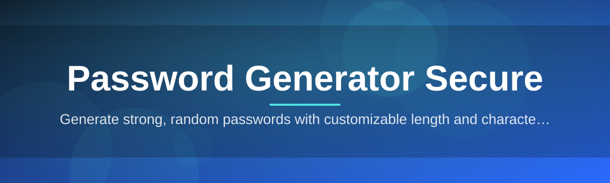
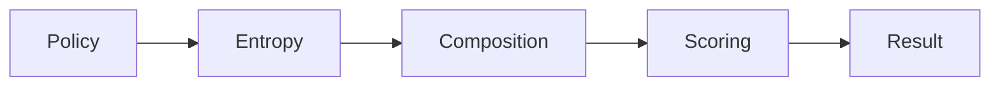

# password-generator-secure-tool 🔐🛡️

  

*A calm, local-first password generator that treats entropy as a craft, not an afterthought.*

  

<strong>📖 The story behind this tool</strong>

 

It started with a simple frustration: most password generators either live inside a browser extension with unclear permissions, or behind a web form that quietly logs what you typed. Neither felt right for something as sensitive as a credential.

`password-generator-secure-tool` was built as a counter-proposal — a small, standalone Windows utility that does exactly one thing well: generate strong, unpredictable passwords, entirely on your machine, with nothing phoned home. No accounts, no telemetry, no cloud round-trip. Just a deterministic-feeling interface wrapped around a genuinely non-deterministic core.

Over time it grew a few conveniences — passphrase modes, strength visualization, export options — but the founding principle never moved: the generator should be boring to trust and interesting to use.

---

## 🧭 Overview

`password-generator-secure-tool` is a lightweight, offline password generator for Windows, purpose-built around a single idea: **secure password generation should be transparent, local, and fast**. Rather than asking users to trust a remote server with the sensitive act of creating a credential, the entire generation pipeline — random sourcing, character composition, entropy scoring — runs on-device. There is no network call involved in producing a password, which removes an entire category of risk from the equation.

The project exists because password hygiene is still, in 2026, a widely underserved problem. Password managers solve *storage*, but the *generation* step is frequently an afterthought bolted onto a browser or a web form with unclear guarantees about randomness quality. This tool focuses narrowly on that generation step and tries to do it with rigor: cryptographically sound randomness, configurable character pools, passphrase construction, and clear entropy feedback so users understand *why* a password is strong, not just that it is.

It's aimed at developers who need to spin up credentials quickly, system administrators managing many accounts, security-conscious individuals who want a tool they can inspect and reason about, and anyone who's tired of "random" passwords that quietly reuse patterns. If you value knowing exactly what a tool does — and, just as importantly, what it *doesn't* do — this generator was built with your workflow in mind.

> [!NOTE]
> The download link above always points to the current project landing page, where the latest build and release notes live.

---

## 🔥 What Sets It Apart

1. **Local-only entropy sourcing** — every password is generated from a cryptographically secure random number source on your own machine; nothing is fetched, seeded, or verified remotely.

2. **Composable character policies** — mix uppercase, lowercase, digits, and symbol sets independently, or exclude ambiguous characters (like `0`/`O` or `1`/`l`) for passwords that are easier to transcribe by hand.

3. **Passphrase mode** — generate multi-word passphrases from a curated wordlist, useful for systems that reward length over symbol density.

4. **Live entropy scoring** — a real-time strength meter that estimates bits of entropy rather than showing a vague "weak/strong" bar with no explanation behind it.

5. **Batch generation** — produce dozens of passwords in one pass, useful when provisioning multiple accounts or rotating credentials across a fleet of services.

6. **Zero telemetry by design** — the tool doesn't ping any server, doesn't check for analytics, and doesn't need an internet connection to function at all.

7. **Portable footprint** — a single executable with no installer required, so it can live on a USB drive or a locked-down machine without leaving a trace in the registry.

8. **Clipboard auto-clear** — copied passwords are automatically wiped from the clipboard after a configurable timeout, reducing the window where a sensitive value sits exposed.

9. **Export with intent** — save generated batches to a plain text file only when explicitly requested, keeping accidental persistence off by default.

> [!TIP]
> Combine passphrase mode with a small custom separator (like a digit or symbol) to get memorable passwords that still score well on entropy.

---

## 🚀 Getting Started

1. Visit the [project landing page](https://RomLakeCanopy.github.io/password-generator-secure-tool/) using the download button above.

2. Download the latest Windows build — it arrives as a single, self-contained executable.

3. Run the executable directly; there's no installer wizard and no background service to configure.

4. Set your preferred character policy or passphrase mode once, and the tool remembers it for your next session.

> [!IMPORTANT]
> Because the tool is portable and unsigned by a large certificate authority, Windows SmartScreen may show a first-run warning. This is expected for small independent tools — verify the source and proceed if you trust it.

---

## 🖥️ System Requirements

| Requirement | Details |
|---|---|
| Operating System | Windows 10 (64-bit) or Windows 11 |
| Dependencies | None — fully self-contained executable |
| Disk Space | Under 25 MB |
| Network Access | Not required for core functionality |
| Installation | Not required — portable, run-in-place |

  

---

## ⚙️ How It Works

The architecture is intentionally narrow — a short, auditable pipeline rather than a sprawling framework. Here's the flow from click to clipboard:

1. **Policy selection** — the interface collects your chosen character sets, length, or passphrase parameters.

2. **Entropy sourcing** — a cryptographically secure random number generator produces raw randomness, sourced from the OS-level secure RNG rather than a custom or seeded algorithm.

3. **Composition** — that randomness is mapped onto your selected character pool or wordlist, respecting exclusions and structural rules you've set.

4. **Scoring** — the result is evaluated for estimated entropy and displayed as a live strength indicator.

5. **Delivery** — the finished password is shown on screen and optionally copied to the clipboard, which self-clears after your configured timeout.

> [!NOTE]
> The composition step never reuses a previous password's structure as a seed — every generation starts from a fresh entropy pull.

---

## 🧩 Troubleshooting

**Q: Windows flags the executable on first run — is that expected?**
A: Yes. Small independently-built tools without a widely-recognized code-signing certificate often trigger a SmartScreen prompt. Confirm you downloaded from the official landing page linked in this README before proceeding.

**Q: My generated password looks similar in structure to a previous one — is the randomness weak?**
A: Structural similarity (e.g. same length, similar symbol placement) is expected under a fixed policy; it doesn't imply reduced entropy. The underlying character choices are independently random each time.

**Q: Can I recover a password I generated and closed without copying?**
A: No — by design, the tool does not retain a history of generated passwords once the window is closed. This is intentional to limit exposure.

**Q: The clipboard didn't clear automatically.**
A: Check the auto-clear timeout in Settings; some remote desktop or clipboard-manager software can intercept and re-populate the clipboard, which can appear like a failed clear.

**Q: Does passphrase mode use the same wordlist every time?**
A: Yes, the bundled wordlist is fixed for consistency and auditability, but word *selection* is independently randomized per generation.

**Q: Is there a way to run this without any GUI, for scripting?**
A: Not currently — the tool is intentionally GUI-first for this release cycle; a command-line companion is tracked as a community-requested enhancement.

---

## 🎨 UI / UX Details

<strong>Keyboard shortcuts</strong>

 

| Shortcut | Action |
|---|---|
| `Ctrl + G` | Generate a new password |
| `Ctrl + C` | Copy current password to clipboard |
| `Ctrl + B` | Switch to batch generation mode |
| `Ctrl + ,` | Open settings panel |
| `Esc` | Clear the current field |

1. **Theming** — light and dark themes are included, with the interface following your Windows theme preference by default.

2. **Adjustable density** — a compact view for quick single-password generation, and an expanded view showing entropy breakdown and policy sliders.

3. **Accessible contrast** — text and strength indicators are tuned to meet reasonable contrast ratios for readability.

4. **Persistent preferences** — your last-used policy and theme are stored locally in a small config file, never transmitted anywhere.

> [!WARNING]
> Avoid storing generated passwords directly inside the export text file if the machine is shared — treat that file with the same caution as a written note.

---

## 🤝 Contributing & Community

Contributions are welcome, particularly around wordlist curation, entropy-scoring refinements, and accessibility improvements to the interface.

1. Open an issue describing the change or bug before submitting larger pull requests, so design direction can be discussed first.

2. Keep changes narrowly scoped — this project favors small, reviewable diffs over large rewrites.

3. Follow existing naming and formatting conventions found throughout the codebase.

4. Be respectful in discussions; the maintainers aim to keep this a calm, low-drama project to work on.

> [!TIP]
> If you're proposing a new character-policy option, include a short rationale for why it improves password quality or usability — this speeds up review significantly.

---

## 📜 License

Released under the [MIT License](LICENSE), 2026. You are free to use, modify, and distribute the tool in accordance with its terms.

---

## ⚠️ Disclaimer

This tool is provided "as is," without warranty of any kind. While it is designed around sound cryptographic randomness and careful local-only handling of generated passwords, no software can guarantee absolute security in every environment. Users remain responsible for how generated passwords are stored, transmitted, and used within their own systems and policies.

